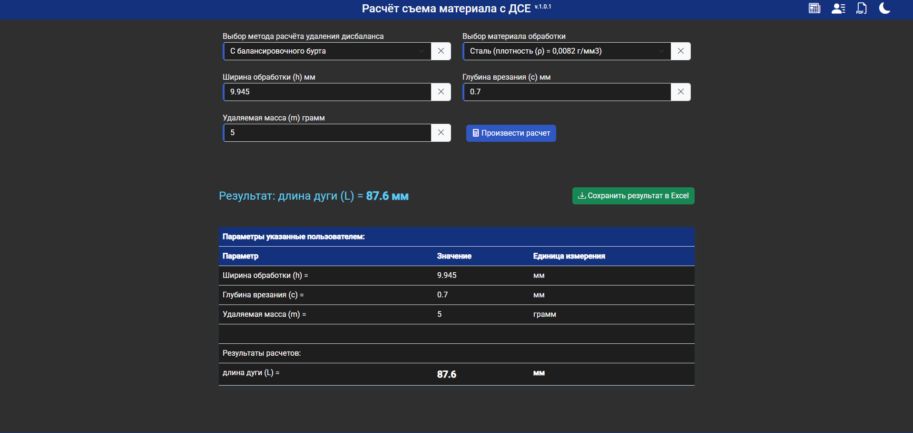

# ПО "Расчет съема материала с ДСЕ" на Angular 19

## 🚀 Сайт разработчика: [https://mattheweb.ru](https://mattheweb.ru/git-readme-calc-matui)

## Описание ПО
Программа с помощью формул, в зависимости от выбранного метода расчета, вычисляет длину дуги или количество выступов с бурта
### 🛠 Cтек
    @angular/core: 19.1.0
    @ngx-translate/core: 16.0.4
    @ngx-translate/http-loader: 16.0.1
    @ng-bootstrap/ng-bootstrap: 18.0.0
    bootstrap: 5.3.3
    bootstrap-icons: 1.11.3
    typescript": "5.7.2
    SCSS
    HTML 5
    Intellij IDEA v.2024.3
### Цель ПО
Данное ПО предназначено для расчета геометрических характеристик удаляемой поверхности в зависимости от необходимой удаляемой массы дисбаланса.

### Общий вид ПО
#### Главный компонент (Темная тема)

  

